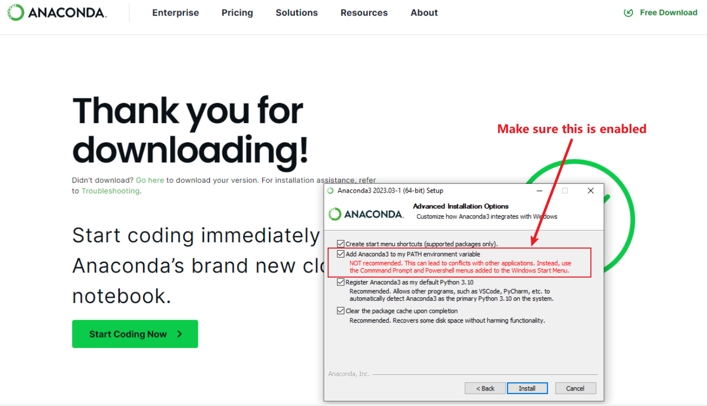

# Setting Up Your Python Code Base on a PC
Author: Matt Hardy, 12/19/2024
## Table of Contents
- [Introduction](#introduction)
- [Downloading and Installing Anaconda](#downloading-and-installing-anaconda)
  - [Step 1: Download Anaconda](#step-1-download-anaconda)
  - [Step 2: Install Anaconda](#step-2-install-anaconda)
- [Configuring Your Anaconda Environment](#configuring-your-anaconda-environment)
  - [Step 1: Open Anaconda Prompt](#step-1-open-anaconda-prompt)
  - [Step 2: Update Conda](#step-2-update-conda)
  - [Step 3: Create a Virtual Environment](#step-3-create-a-virtual-environment)
  - [Step 4: Activate the Environment](#step-4-activate-the-environment)
  - [Step 5: Verify Installation](#step-5-verify-installation)
- [Important Notes](#important-notes)

---

## Introduction
This guide will walk you through setting up your Python coding environment on a PC. We will use Anaconda, a powerful tool for managing Python installations and virtual environments. Follow these steps carefully to ensure that your system is ready for your coursework.

**Important:** You will always use the **Anaconda Prompt** for these steps. Do not use the "Anaconda Navigator" graphical interface for any part of this process.

**Note:** Multi-line code blocks in this guide are intended to be run **one line at a time**. Copying and pasting the entire block at once may result in errors.

## Downloading and Installing Anaconda

### Step 1: Download Anaconda
1. Navigate to the [Anaconda Download Page](https://www.anaconda.com/download/success) and select the latest version of Anaconda for Windows.
2. Click the download button for **Windows Installer** (64-Bit Graphical Installer, 912.3M) under the "Anaconda Installers" section.

### Step 2: Install Anaconda
1. Once the installer is downloaded, double-click on the file to run it.
2. Follow the installation wizard steps:
   - Accept the license agreement.
   - Choose **Just Me** (recommended for most users).
   - Leave the installation directory as default unless you have a specific need to change it.
3. **Important:** When prompted, check the box to add Anaconda to your PATH environment variable. You may see a warning advising against this, but for our coursework, it is safe to ignore this warning. Adding Anaconda to PATH will make it the primary Python installation on your computer.


4. Finish the installation by clicking the "Install" button. Once complete, click "Finish."

---

## Configuring Your Anaconda Environment

### Step 1: Open Anaconda Prompt
1. Open the Start Menu and search for **Anaconda Prompt**. Click to launch it.

### Step 2: Update Conda
1. Run the following commands to ensure Conda and Anaconda are up-to-date:
   ```bash
   conda update conda
   conda update anaconda
   ```
   Run each line individually by pressing `Enter` after each command.
2. Press `y` when prompted to confirm updates.

### Step 3: Create a Virtual Environment
1. Create a new virtual environment named `dev` using Python 3.10:
   ```bash
   conda create -n dev python=3.10 anaconda -y
   ```
   Run this command as a single line.
   - This environment will include all necessary default packages, such as NumPy, Pandas, and Matplotlib.

### Step 4: Activate the Environment
1. Activate your new environment by entering:
   ```bash
   conda activate dev
   ```
2. Your prompt should now include `(dev)` at the beginning, indicating that the environment is active.

### Step 5: Verify Installation
1. Verify that the necessary packages are installed by running:
   ```bash
   conda list
   ```
   Run this command as a single line.
2. Confirm that the following packages are listed:
   - Numpy
   - Pandas
   - Matplotlib

---

## Important Notes
- Always activate the `dev` environment before running Python code by entering:
  ```bash
  conda activate dev
  ```
- If you need to exit the environment, use:
  ```bash
  conda deactivate
  ```
- Remember to keep Conda updated periodically to avoid compatibility issues.
- Use the **Anaconda Prompt** exclusively for managing environments and running commands as described in this guide.

With this setup, you are now ready to begin your coursework. If you encounter any issues, reach out to your instructional staff for assistance.

